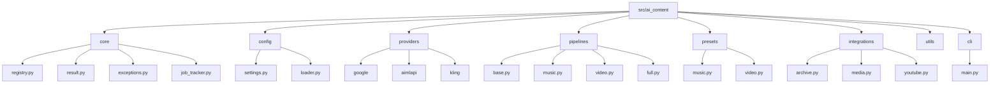
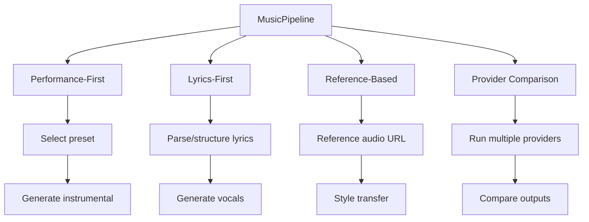
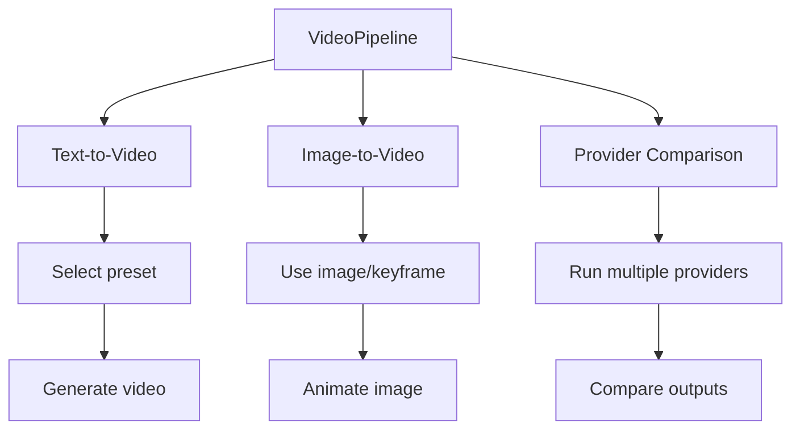
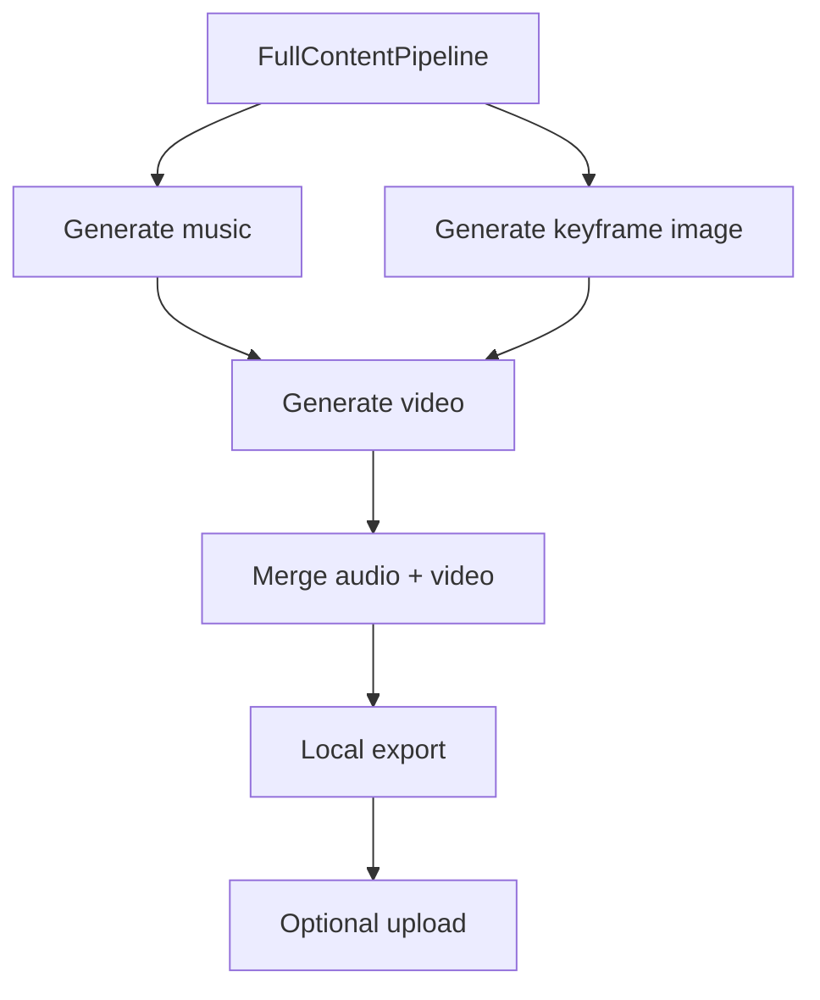

## AI Content Architecture Diagrams

### 1) src/ai_content/ Package Structure



### 2) Providers Overview

```mermaid
graph TD
	P[ProviderRegistry] --> M[Music Providers]
	P --> V[Video Providers]
	P --> I[Image Providers]

	M --> L[Lyria (Google)]
	M --> MM[MiniMax (AIMLAPI)]

	V --> VE[Veo (Google)]
	V --> KL[Kling (KlingAI)]

	I --> IM[Imagen (Google)]
```

### 3) Pipelines

#### 3.1 Music Pipeline Workflows


#### 3.2 Video Pipeline Workflows


#### 3.3 Full Content Pipeline (Music Video)

